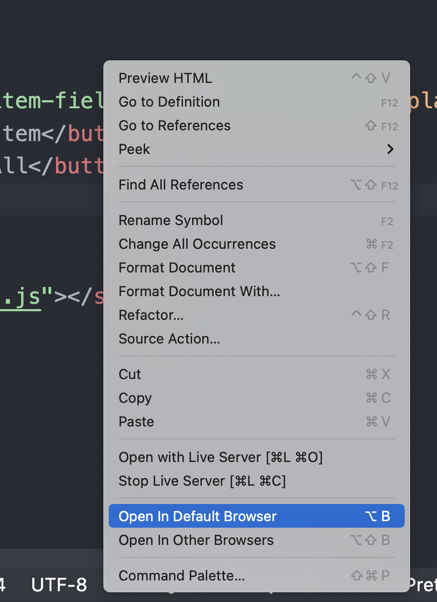

# Andrea Réthy - Entrega 1.1: To Do List

## Repository

https://github.com/AndreaRethy/ToDoList.git

## Introduction

The goal of this exercise is to create a to-do list application using TypeScript and TDD. The application must have the following characteristics:

- Allow adding a task to the list.
- Allow marking a task as completed.
- Allow to remove a task from the list.
- Show the list of tasks.

## Project Setup

Use node version v20.12.2

```
nvm use 20
```

## Test Backend

```
npm test
```

## Front-end:

To test front-end simply open the index.html file in your browser. Right click in the html file and select 'Open in Default Browser' or 'Open in Other Browsers'



To open from command line:

```
open index.html
```

### What to test in front-end

- To add an item: Type in the text box and click "Add New Item"
- To Clear list: Click on "Clear All"
- To mark an item item done simply click on the item
- To remove an item click on it twice (first to mark done, second to remove)
